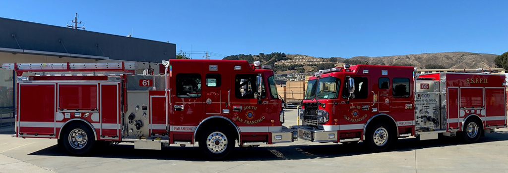

# Fire Incidents Analysis

## About Fire Incidents Dataset

Fire Incidents includes a summary of each (non-medical) incident to which the SF Fire Department responded. Each incident record includes the call number, incident number, address, number and type of each unit responding, call type (as determined by dispatch), prime situation (field observation), actions taken, and property loss.



The dataset url is:
<a href="https://data.sfgov.org/Public-Safety/Fire-Incidents/wr8u-xric"> Link </a>


##  Data Arquitecture

The Data team, needs dimensional tables based on the information provided from a .csv file which is updated daily.
The solution proposed, is developed in AWS, using their different servieces.<br>
The arquitecture developed is the following:


There are differents stages in the datalake: <br>

<ul>
   <li> Raw: Where the .csv file is uploaded everyday. It has the raw data coming from differents sources.
   <li> Refined: Where the information is clean and partitioned by year, month, day. Stored in parquet format
   <li> Redshift: where coexists 3 schemas. prev, stg and dwh
</ul>


# Fire Incidents Library

This library contains all the common code used by the Rooster Music team.

## How to contribute

### Version control

Your commits should follow [Conventional Commits](https://www.conventionalcommits.org/en/v1.0.0/) with these [types](https://github.com/angular/angular/blob/22b96b9/CONTRIBUTING.md#type).

- feat
- fix
- ci
- docs
- chore
- tests
- perf
- refactor

You should branch from **dev**, and your branch name should follow this rule **< type >/< task_description >** i.e. **feat/frontend**

1. Clone the Repository
   ```bash
   git clone https://github.com/tovarfranco/fire-incidents-case-study.git
   ```
   > Note: You can obtain the url from Code.
2. Check the branch you are positioned:
   ```bash
   git status
   ```
   > Note: You will be placed in branch Main. You should start from Dev
3. Go to dev:
   ```bash
   git checkout dev
   ```
   > Note: You will be placed in branch Dev, where you'll start from.
4. For a new feature/bug/fix/refactor, you'll create a branch:
   ```bash
   git checkout -b <type>/<branch_name>
   ```
   > Note: Replace <type> and <branch_name> for your actual information. i.e: feat/frontend
5. Work on your changes.
6. Add your changes:
   ```bash
   git add --all
   ```
7. Commit your changes:
   ```bash
   git commit -m <type:message>
   ```
   > Note: Replace <type:message> to describe your changes. i.e: feat: New readme added.
8. Push your changes:
   ```bash
   git push
   ```
   > Note: You will may be required to set upstream. i.e: git push --set-upstream origin feat/fronted

9. After you finish your feature you must submit a merge request pointing to **dev** branch:
   > Note: You will specify the reviewers that will approve this merge.


## License
[MIT](https://choosealicense.com/licenses/mit/)